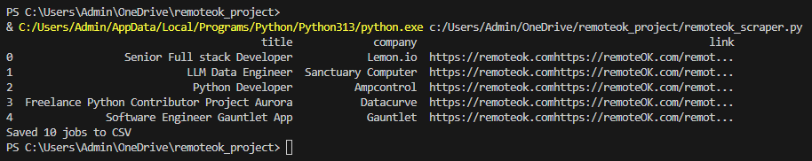

# RemoteOK Python Jobs Scraper

This project is a simple Python script that scrapes job listings from the [RemoteOK](https://remoteok.com/api) API.  
It filters the results to show only jobs that require **Python** and saves them into a CSV file.

## Features
- Fetches the latest remote jobs from the RemoteOK API  
- Filters jobs by the **Python** tag (case-insensitive)  
- Saves results (title, company, link) into a CSV file  
- Prints a preview of the first 5 jobs and the total number of jobs saved  

## Requirements
- Python 3.x  
- [requests](https://pypi.org/project/requests/)  
- [pandas](https://pypi.org/project/pandas/)  

You can install the required libraries with:

```bash
pip install requests pandas

## Screenshots

### Script Running


### CSV File with Results
